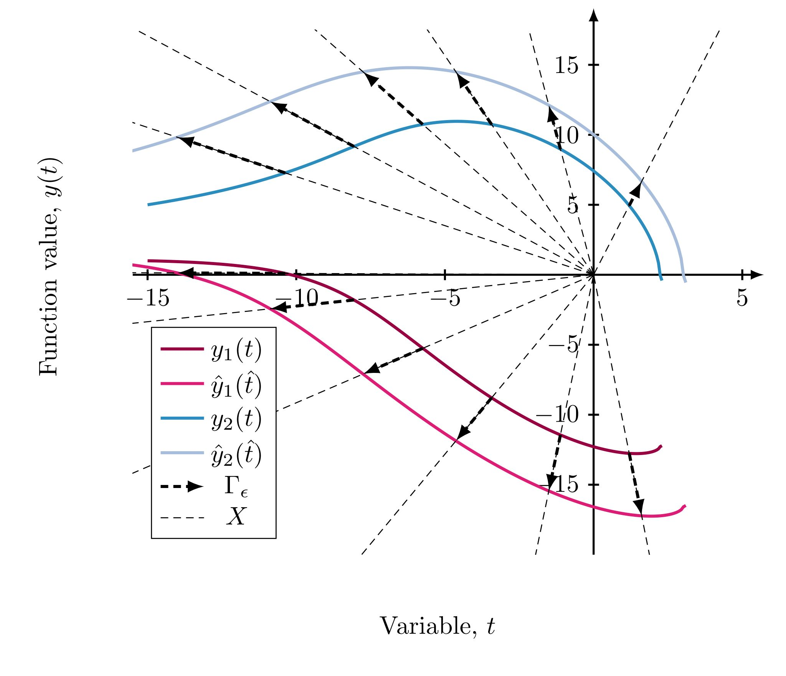

# symSys_1st_ODEs
**Author**: Johannes Borgqvist 
**Date**: 2021-06-02 
Welcome to the git repositry "*symSys_1st_ODEs*". This is a Python and LaTeX based project which conducts automated symbolic calculations of the symmetries of systems of first order ODEs using [sympy](https://www.sympy.org/en/index.html). This repositry is linked to the article (**Reference to future article**) and the aim of this repositry is that users should be able to reproduce the presented symmetries in an automated way. Let's describe the project and the way all relevant packages are installed. 

## Description of the project
One of the great difficulties with calculating symmetries of systems of differential equations is the high dimension of the resulting symmetry calculations. This is due to the fact that symmetry methods view differential equations from a geometrical perspective, each variable (e.g. time t and space x) and each states correspond to a variable in a highdimensional geometrical manifold being the solution space (i.e. the set of all solutions) of the system of differential equations in question. Technically, to find the symmetries of a system of differential equations we must solve a system high dimensional PDE where the dimension of these PDEs is determined by the number of variables plus the number of states and the number of derivatives in the differential equation at hand. In general, there is no theory for solving such high dimensional systems analytically and thus the task of finding symmetries is very complicated. Therefore, symmetry methods are often restricted to low dimensional differential equations where all calculations can be made by hand. The aim of this project is to try to automate the involved symmetry calculations using a symbolic solver and here we focus on systems of first order ODEs which are common in mathematical biology being the context for this article. One system of such ODEs is what we refer to as Hydon's model given by

 
 

and it has the the following *scaling symmetry*

 

Below, we illustrate the action of this symmetry on a solutions to the Hydon model. 

Now the aim of this project is that the user should be able to find the generators, such as the scaling generator to Hydon's system above, to a given system of first order ODE *without having to do any calculations by hand*. This is an attempt at automating these calculations, and all you have to do is to provide your model in an xlsx-file in the Input folder. Then by running the Python-script *launch\_symmetry\_calculations.py* in the Code folder, the symmetries of the defined model will be returned in the output folder. This might sound quite amazing, but there are some serious limitations to this implementation which will be described next. Also, we will describe how to install all libraries properly in order to run the scripts, but let's start with the limitations of the implemented symbolic solver for calculating the symmetries of systems of first order ODEs. 

## Computational limitations of the symbolic computations  

## Pre-requisites to run the scripts
The scripts have been developed on a laptop with the following operating system: 
**Ubuntu 20.10** 
with the following properties: 
**Kernel: Linux 5.8.0-53-generic** 
**Architecture: x86-64**. 
The programming has been done in Python, and as an output the script generates a LaTeX-file with the calculated generator. The versions of packages required for the programming scripts are the following: 
1. *python*, version 3.8.3,
2. *pandas*, version 1.0.5,
3. *notebook*, version 6.0.3,
4. *anaconda*, version 2020.07 (*not required but convenient*).  

The script also generates a LaTeX report with *pdflatex*. The version of *pdflatex* that has been used for this project is the following: 
**pdfTeX 3.14159265-2.6-1.40.21 (TeX Live 2020/Debian)**, 
**kpathsea version 6.3.2**, 
**Copyright 2020 Han The Thanh (pdfTeX) et al.** 

To run all scripts and generate a report, a bash script called "*run\_all.sh*" has been created. It might be neccessary to get permission to run the file first which can be done by typing "*chmod +x run\_all.sh*" and then the script is executed with the command "*./run\_all.sh*".
## Setting up the project using anaconda
The easiest way to get the scripts to work properly is to install [anaconda](https://docs.anaconda.com/anaconda/install/). When anaconda is installed, create an environment for the project using the file "*sym\_sys\_1st\_ODEs.txt*" in the following way: 

"*conda create --name sym\_sys\_1st\_ODEs --file sym\_sys\_1st\_ODEs.txt*" 
which creates an anaconda environment called "*sym\_sys\_1st\_ODEs*". After this, the environment is activated with the command: 
*conda activate sym\_sys\_1st\_ODEs*, 
and it is deactivated using 
*conda deactivate*.  
Alternatively, all the packages could be installed manually in the following way: 

*conda create -n *sym\_sys\_1st\_ODEs* python sympy pandas scipy* 
*conda install -n *sym\_sys\_1st\_ODEs* -c conda-forge pickle5* 
*conda install -n *sym\_sys\_1st\_ODEs* -c anaconda csvkit* 
*conda install -n *sym\_sys\_1st\_ODEs* -c anaconda more-itertools* 
*conda install -n *sym\_sys\_1st\_ODEs* -c conda-forge multiprocess* 

